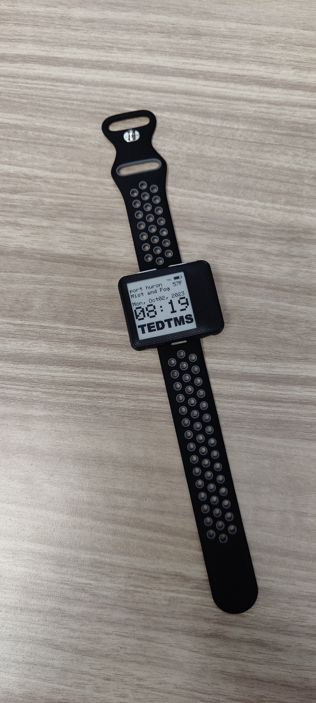

<h1 align = "center">OpenWatch</h1>

This project is my custom modification of LILYGO's stock example firmware for the [LILYGO T-Wrist E-paper 1.54in Display](https://www.lilygo.cc/products/t-wrist-e-paper-1-54-inch-display?variant=42405749948597).
I was also inspired to do this project in the first place by [qewer33's qpaperOS project](https://github.com/qewer33/qpaperOS). However, I found the LILYGO firmware to be an easier place to start making my own modiications, so I forked that project instead. 

> <b>DISCLAIMER:</b>
> I am an absolute amateur and by <i>no</i> means an actual developer. All of my modifications to this firmware have been done by reverse-engineering what LILYGO provided and performing lots of trial and error. Things will be wrong, or unoptimized, or both; offers to contribute to the project to improve it are absolutely welcome but complaint issues will be summarily deleted.

--------------------------------------

<h2 align = left>Assembly Instructions</h2>

To build the watch, you will need the following:
    [LILYGO T-Wrist E-Paper ESP32 development board (with T-U2T USB/serial adapter)](https://www.lilygo.cc/products/t-wrist-e-paper-1-54-inch-display?variant=42405749948597) (Note: you don't need to buy the GPS version but if you don't have a LILYGO T-U2T, buy a version with T-U2T bundled. You need T-U2T to program the board!)
    3D printed "Shell" piece (provided by qewer33)
    3D printed "Bottom Plate" piece (provided by qewer33)
    3D printed "Buttons" piece (provided by qewer33)
    250 mAh 1S lipo battery (I used this one: https://www.amazon.com/dp/B091FBD9KZ)
    4x short M2/M1.6/M1.4 screws
    22mm watch strap (compatible with Huawei GT2/GT3 straps)

<h2 align = "left">Build Instructions</h2>

Building from scratch requires:
- The Adafruit-GFX-Libarary (specifically, [lewisxhe/fork/GxEPD](https://github.com/lewisxhe/GxEPD))
- The ESP32 Dev Module, if using Adafruit-IDE

However, I just used VSCode:
1. Clone this repo using VSCode
2. Install PlatformIO extension
3. Connect a USB cable to LILYGO's T-U2T adapter
4. Connect the T-U2T adapter to the E-paper board
5. Connect the USB cable to your machine

LILYGO included all the necessary libraries in their repo and I carried them over into this fork so no other dependency installation should be necessary.

--------------------------------------

<h2 align = left>Major Changes</h2>

The biggest changes in my build from the LILYGO stock example firmware are:
- Changed the rotation 90-degrees so the display will show properly when using the watch case design provided by qewer33
- Cleared out all the cruft example files and keeping only the source and libraries for "WatchDemoNoGPS"
- Changed format of the date to "Day, MonthDate, Year" instead of "Year, Month, Day" (displays like "Tuesday, Sept19, 2023")
- Updating the HttpClient used for weather API data fetching to use [AerisWeather's API](https://www.aerisweather.com/) instead of Seniverse (China only)
- Split out WiFi and weather API credentials into secrets.h (not managed by git)
- Changed LILYGO boot logo to Open Source Hardware logo
- Changed LILYGO watch display logo to "tedtms" logo
- Added task to reconnect WiFi, sync NTP/weather every 15min
- Changed NTP servers

<h2 align = left>Roadmap</h2>

My planned enhancements to this project include:
- Updating the font to something nicer, perhaps the font used by qpaperOS
- Removing the watch display's bottom logo and filling that space with weather forecast data from AerisWeather
- Rearranging the display elements for better aesthetic

<h2 align = left>Known Problems</h2>

There are a couple of problems I'm currently trying to work out (and will be tracking as Issues):
- The battery life is abysmal for some reason. Even running LILYGO's stock firmware, a 250mAh LiPo battery lasts roughly 4 hours
- The way the stock firmware implements RTC sync is creating a 1-hour offset for the time that changing the timezone or DST offset values doesn't fix. I have commented out that line for now but would like to figure out what's causing the issue.

